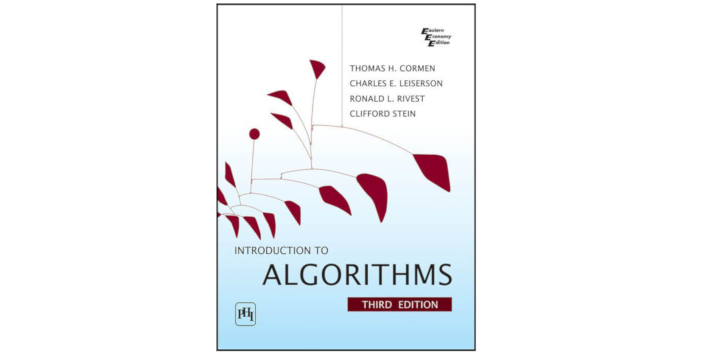

# Introduction to Algorithms




## Description

This repository is the collection of programs which are either solutions to a
problem or example pseudocode at [the Introduction to Algorithm
book][introduction_to_algorithm]. These programs are written in [Python][python]
programming language.


### Generate solutions in PDF file

To generate a PDF file, fire below command. Make sure [LaTeX][latex] is
installed.

```
make build
```

Above command will generate a solutions at `output` directory located a root of
this project.

[introduction_to_algorithm]: https://www.goodreads.com/book/show/108986.Introduction_to_Algorithms
[python]: https://www.python.org/
[latex]: https://www.latex-project.org
